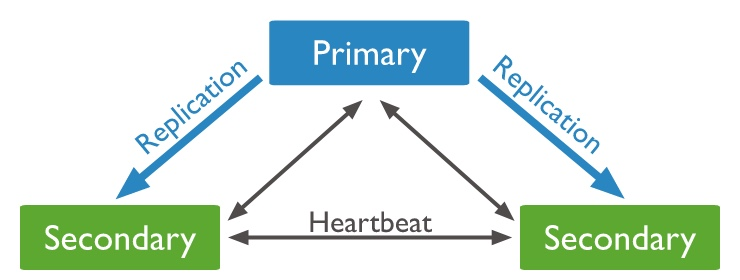

# 前言

上一篇「使用 Docker 構築不同 MongoDB 架構 (二) - Standalone」，我們介紹了 docker-compose 的基本操作，這次我們要來構築 *Replica Set*。在 *Sharded Cluster* 中 *shard* 和 *config servers* 就是用*Replica Set* 構築。

為了專注構築 *Replica Set*，我們先不引入安全性的設定，可以參考 [Security Checklist](https://docs.mongodb.com/manual/administration/security-checklist/)。


> 本系列文的專案放在：[https://github.com/eugenechen0514/demo_mongo_cluster](https://github.com/eugenechen0514/demo_mongo_cluster)

# 架構

一個最基本的 Replica Set 至少要三個 member，一個 Primary、二個 Secondary，如下圖


Primary/Secondary 都是有實際存資料的 member，若在硬體不夠的情況下，Mongo 提供 [Arbiter](https://docs.mongodb.com/manual/core/replica-set-arbiter/) 這種形態的 member，它只參與[投票](https://docs.mongodb.com/manual/core/replica-set-elections/#replica-set-elections)，本身不存資料也不能成為 Primary，如下圖


> 若使用 Primary-Second-Arbiter 三個節點，有件事需要注意。當存有資料的節點(Primary/Second)死掉且使用 "majority" read concern 時會導致 cache pressure。見：[Read Concern majority and Three-Member PSA](https://docs.mongodb.com/manual/tutorial/add-replica-set-arbiter/#read-concern-majority-and-three-member-psa)

接下來，我們使用 docker-compose 構築 Primary-Secondary-Secondary 的 Replica Set。

# Docker Compose


我們的 Replica Set 名稱叫 `RS`，所以要用到 `--replSet RS`。一共建立三個 container (**rs1**/**rs2**/**rs3**)，port 分別為 **27041**/**27042**/**27043**。另外，為了使 Replica Set 的網路設定更有彈性，我們使用 `extra_hosts` 設定容器 DNS，而不是寫死 IP。

> 因為 `network_mode` 是 `host`，所以資料庫就如同架設在本機端， `rs1.local` / `rs2.local` / `rs3.local` 都會對應到 `127.0.0.1`。

接下來，就可以
``` shell
$ docker-compose -f docker-compose-replica-set.yml up
```
建立執行容器。

## **docker-compose-replica-set.yml**
``` yml
version: '3'
services:
  rs1:
    image: mongo:4.2
    container_name: rs1
    network_mode: host
    command: mongod --replSet RS --port 27041 --dbpath /data/db --config /resource/mongod.yml
    volumes:
      - ./replica/config/mongod.yml:/resource/mongod.yml
      - ./replica/data/rs1:/data/db
    extra_hosts:
      - "rs1.local:127.0.0.1"
      - "rs2.local:127.0.0.1"
      - "rs3.local:127.0.0.1"
  rs2:
    image: mongo:4.2
    container_name: rs2
    network_mode: host
    command: mongod --replSet RS --port 27042 --dbpath /data/db --config /resource/mongod.yml
    volumes:
      - ./replica/config/mongod.yml:/resource/mongod.yml
      - ./replica/data/rs2:/data/db
    extra_hosts:
      - "rs1.local:127.0.0.1"
      - "rs2.local:127.0.0.1"
      - "rs3.local:127.0.0.1"
  rs3:
    image: mongo:4.2
    container_name: rs3
    network_mode: host
    command: mongod --replSet RS --port 27043 --dbpath /data/db --config /resource/mongod.yml
    volumes:
      - ./replica/config/mongod.yml:/resource/mongod.yml
      - ./replica/data/rs3:/data/db
    extra_hosts:
      - "rs1.local:127.0.0.1"
      - "rs2.local:127.0.0.1"
      - "rs3.local:127.0.0.1"
```

這裡注意到所有容器都要能解析域名 `rs1.local` / `rs2.local` / `rs3.local`，因此都要設定 `extra_hosts`。

## **replica/config/mongod.yml**
``` yml
net:
  bindIpAll: true
storage:
  engine: wiredTiger
  wiredTiger:
    engineConfig:
      cacheSizeGB: 0.1
```

# Replica Set 設定

## 1. 確認資料庫連線
連入 **rs1** container，確認能不能用域名(domain)連線到 **rs1**/**rs2**/**rs3** 資料庫。

``` shell
# 進入(執行 bash) rs1 container
$ docker-compose -f docker-compose-replica-set.yml exec rs1 bash
```

> 若不特別說明，之後的操作是指在 **rs1** container 中。

確認資料庫連線
``` shell
$ mongo rs1.local:27041 --eval "print('ok')"
$ mongo rs2.local:27042 --eval "print('ok')"
$ mongo rs3.local:27043 --eval "print('ok')"
```
確認是否都可以印出 *ok*，接下來開始設定 Replica Set。


## 2. 設定 Replica Set
随便選一個 member, 連入資料庫

``` shell
$ mongo rs1.local:27041
```

設定 Replica Set 組態

``` javascript
cfg = {
  "_id": "RS",
  "members": [{
      "_id": 0,
      "host": "rs1.local:27041"
    },
    {
      "_id": 1,
      "host": "rs2.local:27042"
    },
    {
      "_id": 2,
      "host": "rs3.local:27043"
    }
  ]
};
rs.initiate(cfg);
```

印出 `ok: 1` 就設定完成。

## 3. 測試連線

連入 Replica Set

``` shell
$ mongo --host RS/rs1.local:27041,rs2.local:27042,rs3.local:27043
```
> 我們使用 `rs1.local` / `rs2.local` / `rs3.local` 域名連線，所以執行 `mongo shell` 的主機要確認可以解析成資料庫所在的 IP。

隨便寫入資料
``` javascript
db.col.insertOne({text: 'hi'})
```

印出
```
{
        "acknowledged" : true,
        "insertedId" : ObjectId("5dff2ea59b9f4570f9214660")
}
```

以上就完成了 Replica Set 的架設。接下來，列出一些在管理 Replica Set 時，常使用的指令。


# 確認 Replica Set 狀態

當我們要增加/減少 member 或是檢查 member 是否有連線時，常常需要確認 member 狀態。**rs** 有三個常用的指令 `rs.status()`, `rs.printReplicationInfo()`, `rs.printSlaveReplicationInfo()`。

1. `rs.status()`：查看 [members 狀態](https://docs.mongodb.com/manual/reference/replica-states/#replica-set-member-states) (**PRIMARY**/**SECONDARY**/**RECOVERING**/**DOWN**...)。如：
    ``` javascript
    rs.status().members.forEach(m => print(`${m.name} =>  ${m.stateStr}`))
    ```
    印出
    ```
    rs1.local:27041 =>  PRIMARY
    rs2.local:27042 =>  SECONDARY
    rs3.local:27043 =>  SECONDARY
    ```
1. `rs.printSlaveReplicationInfo()`：members 的同步狀態
    ```
    source: rs2.local:27042
            syncedTo: Sun Dec 22 2019 07:55:10 GMT+0000 (UTC)
            0 secs (0 hrs) behind the primary 
    source: rs3.local:27043
            syncedTo: Sun Dec 22 2019 07:55:10 GMT+0000 (UTC)
            0 secs (0 hrs) behind the primary 
    ```
1. `rs.printReplicationInfo()`：members 的 [oplog](https://docs.mongodb.com/manual/reference/glossary/#term-oplog) 狀態
    ```
    configured oplog size:   1354.0509757995605MB
    log length start to end: 183secs (0.05hrs)
    oplog first event time:  Sun Dec 22 2019 07:52:18 GMT+0000 (UTC)
    oplog last event time:   Sun Dec 22 2019 07:55:21 GMT+0000 (UTC)
    now:                     Sun Dec 22 2019 07:55:27 GMT+0000 (UTC)
    ```

# 總結

本篇我們介紹了如何使用 docker-compose 構築 Replica Set，以及提到三個確認 Replica Set 狀態的指令。此外，我們還刻意使用域名設定 Replica Set 組態，為了使資料庫主機的移動可以增加一些彈性。

# 附錄：連線常見問題

## 防火牆 (firewall)

架設資料庫的主機需要設定防火牆才能讓別人連入

```shell
firewall-cmd --add-port=27041/tcp
firewall-cmd --add-port=27041/tcp --permanent

firewall-cmd --add-port=27042/tcp
firewall-cmd --add-port=27042/tcp --permanent

firewall-cmd --add-port=27043/tcp
firewall-cmd --add-port=27043/tcp --permanent
```

## 域名解析設定/DNS 設定

因為執行 `mongo shell` 的主機要確認可以解析成資料庫所在的 IP，你可能需要修改 `hosts`，讓執行 `mongo shell` 的主機可以正確的解析 IP。


* 假設我們的執行 `mongo shell` 的主機和資料庫都架設在本機端。因此修改 `hosts`
    ``` shell
    $ vi /etc/hosts
    ```
    
    在下面加入域名解析的IP，
    ```
    127.0.0.1 rs1.local
    127.0.0.1 rs2.local
    127.0.0.1 rs3.local
    ```
* 若是 `mongo shell` 是在容器中執行，可以用 `extra_hosts` 設定 `hosts`，或修改容器裡的 `/etc/hosts`